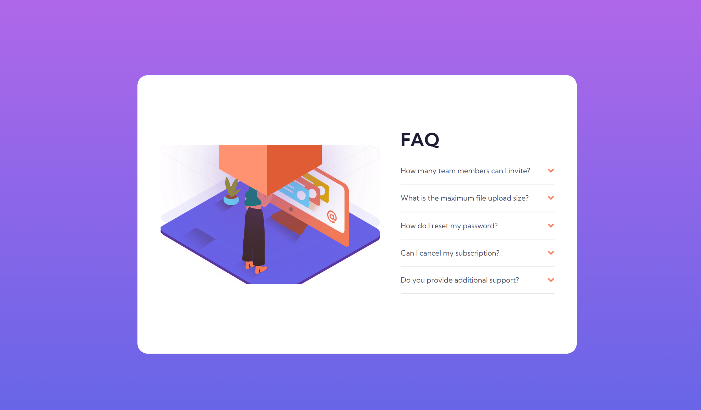
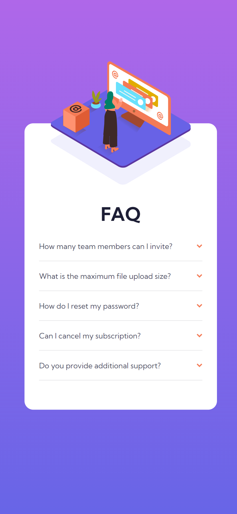

# Frontend Mentor - FAQ accordion card solution

This is a solution to the [FAQ accordion card challenge on Frontend Mentor](https://www.frontendmentor.io/challenges/faq-accordion-card-XlyjD0Oam). Frontend Mentor challenges help you improve your coding skills by building realistic projects. 

## Table of contents

  - [The challenge](#the-challenge)
  - [Screenshot](#screenshot)
  - [Links](#links)
- [My process](#my-process)
  - [Built with](#built-with)
  - [What I learned](#what-i-learned)
  - [Continued development](#continued-development)
- [Author](#author)

### The challenge

Users should be able to:

- View the optimal layout for the component depending on their device's screen size
- See hover states for all interactive elements on the page
- Hide/Show the answer to a question when the question is clicked

### Screenshot





### Links

- Solution URL: [solution](https://github.com/mbilal-x/frontendmentor_P4_faq-accordion-card-main)
- Live Site URL: [live site](https://mbilal-x.github.io/frontendmentor_P4_faq-accordion-card-main)

## My process
I worked on mobile design first, set HTML, added CSS, and then finally added Js to make the answer toggle on click.
### Built with

- Semantic HTML5 markup
- CSS custom properties
- Js event handling
- Flexbox
- Mobile-first workflow

### What I learned

I learned why relative units are so useful. After I moved on to making the desktop design, I had to reset all margin and padding properties, here I hoped I had used *rem* instead of *px* everywhere.
I also didn't know how to use *querySelectorAll* is only had some practice with *querySelector*, that's why only the 1st question is working on click.

 -> update: I have updated the js logic


```js

// old
const question = document.querySelector('.Q-item__question');
const answer = document.querySelector('.Q-item__answer');
const icon = document.querySelector('.question__icon');

question.addEventListener("click", function(){
    answer.classList.toggle('Q-item__answer-toggle');
    question.classList.toggle('Q-item__question-toggle');
    icon.classList.toggle('question__icon-toggle');
});


// new
let questions = document.querySelectorAll('.Q-item__question');

questions.forEach(question => {
  question.addEventListener("click", function() {

    this.classList.toggle('Q-item__question-toggle');

    let answer = this.nextElementSibling;
    if (answer.style.display === "block") {
            answer.style.display = "none";
          } else {
            answer.style.display = "block";
          }

    let icon = this.querySelector('.question__icon');
    icon.classList.toggle('question__icon-toggle');
  })
})
```

### Continued development
stuff to look into: 
  - js Events and DOM                                  [done]
  - CSS multiple background and their positioning      [done]
  - relative units and how to properly use them        [done]

## Author

- Website - [Muhammad Bilal](mohammadbilal.me)
- Frontend Mentor - [@mbilal-x](https://www.frontendmentor.io/profile/mbilal-x)
